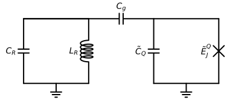
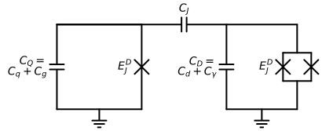

# Welcome
This repository includes Mathematica notebooks and Jupyter notebooks for calculating needed capacitances for desired couplings between Transmon and Readout resonator 

and between two Transmons (in our case a transmon-dissipator).

There is also a Jupyter notebook for for developing your own circuit diagrams using `schemdraw`.

# Online Calculator
If you do not want to download the repository or Jupyter files, you can calculate these couplings [by clicking here](https://moumhecht.github.io/transmon-dissipator-cap-calcs/ "Go to Coupling Calculator")

# Requirements
1. `scipy`
2. `numpy`
3. `schemdraw`
